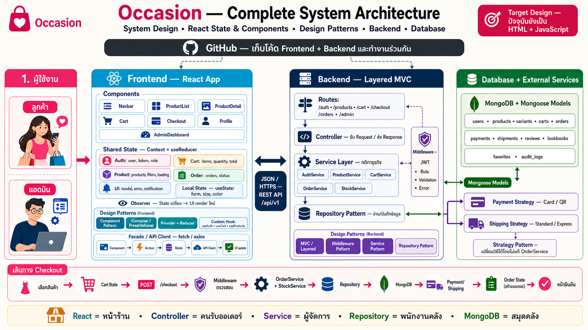
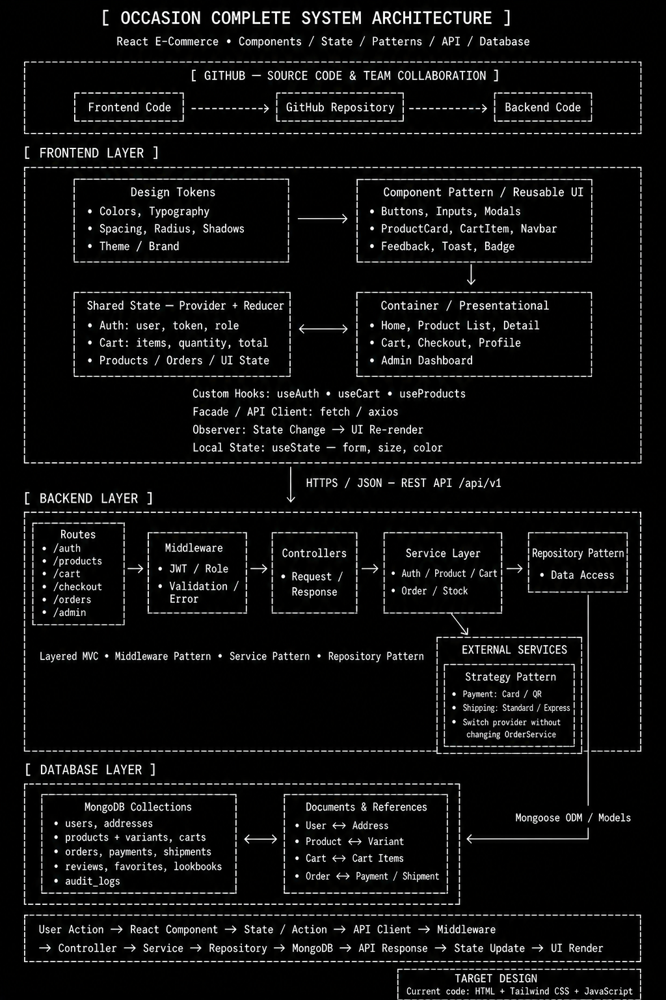
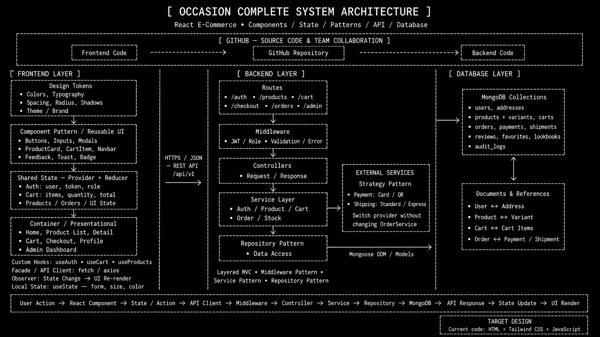
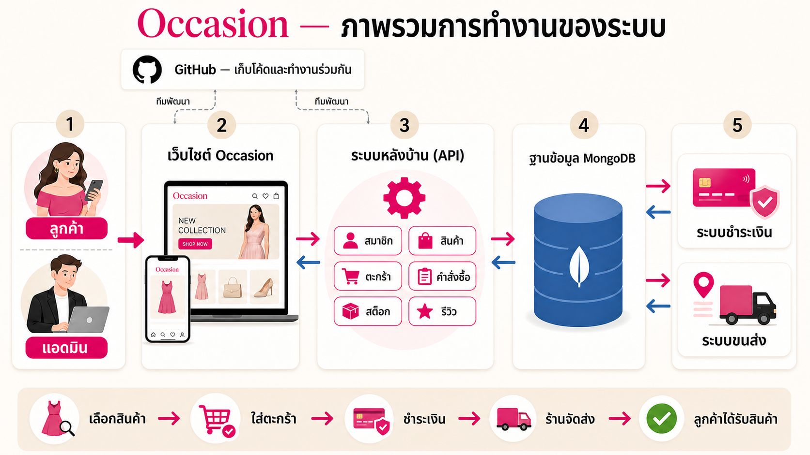
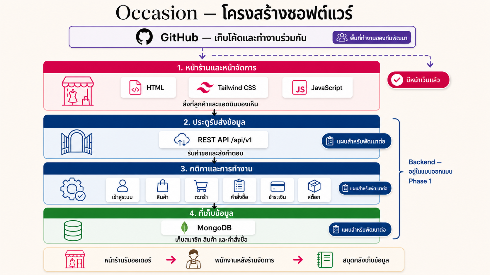

# Occasion Target System Design & Software Architecture

> **สถานะ:** เอกสารอ้างอิงสำหรับพัฒนาหลัง Sprint 1 ภาพ React, REST API, Backend, MongoDB, Payment และ Shipping เป็น target design ไม่ใช่ implementation ใน repository นี้ ดูขอบเขตที่ส่งมอบจริงใน [Sprint 1 Scope and Closeout](../SPRINT1_SCOPE.md)

เอกสารชุดนี้อธิบายภาพรวมระบบ Occasion เป้าหมายสำหรับผู้ฟังที่ไม่จำเป็นต้องมีพื้นฐานด้านเทคนิค

## Complete System Architecture — ภาพหลักสำหรับนำเสนอ

ภาพนี้รวมผู้ใช้งาน, GitHub, React components, shared/local state, frontend design patterns, REST API, Backend แบบ Layered MVC, middleware, services, repository, MongoDB collections, Payment/Shipping Strategy และเส้นทาง Checkout ไว้ในภาพเดียว

> ภาพรวมนี้เป็น Target Design สำหรับการพัฒนาต่อ ปัจจุบัน repository ยังเป็น HTML, Tailwind CSS และ JavaScript

### Terminal style

เวอร์ชันนี้ใช้รูปแบบขาวดำคล้าย architecture blueprint และแสดงลำดับ `Routes → Middleware → Controllers → Service Layer → Repository → MongoDB` พร้อม Design Patterns และ External Services อย่างชัดเจน

### Terminal style — Landscape 16:9

เวอร์ชันแนวนอนสำหรับใช้บน presentation slide โดยคง Components, State, Design Patterns, Backend, Database, GitHub, External Services และ runtime flow ไว้ในภาพเดียว

## React Target Architecture

สำหรับโครงสร้างเป้าหมายที่ระบุ React components, state, API, Backend services และ MongoDB collections แบบละเอียด ดู [React Target Architecture](./react-target-architecture.md)

## Design Patterns

สำหรับ Pattern ที่เชื่อม React, Backend และ Database พร้อมเหตุผลและตัวอย่าง Checkout ดู [Occasion Design Patterns](./design-patterns.md)

## 1. Target System Design — ภาพรวมการทำงานที่วางแผนไว้

ให้นึกถึงระบบเป้าหมายของ Occasion เป็นร้านเสื้อผ้าที่มีทั้งหน้าร้านและหลังร้าน:

- ลูกค้าเลือกสินค้า ใส่ตะกร้า และสั่งซื้อผ่านเว็บไซต์
- แอดมินใช้เว็บไซต์อีกส่วนหนึ่งเพื่อจัดการสินค้า สต็อก คำสั่งซื้อ และรีวิว
- ระบบหลังบ้านรับเรื่องจากเว็บไซต์ ตรวจสอบกติกา และประสานงานส่วนต่าง ๆ
- MongoDB เปรียบเหมือนสมุดคลังกลางที่เก็บข้อมูลสมาชิก สินค้า และคำสั่งซื้อ
- ระบบชำระเงินและระบบขนส่งเป็นบริการภายนอกที่ระบบหลังบ้านติดต่อไป
- GitHub เป็นที่เก็บโค้ดและพื้นที่ทำงานร่วมกันของทีมพัฒนา โดยเชื่อมกับงานหน้าเว็บไซต์และระบบหลังบ้าน ไม่ได้ใช้เก็บข้อมูลลูกค้าหรือคำสั่งซื้อ

## 2. Target Software Architecture — โครงสร้างที่วางแผนไว้

โครงสร้างแบ่งเป็น 4 ชั้น:

1. **หน้าร้านและหน้าจัดการ** — สิ่งที่ลูกค้าและแอดมินมองเห็น ปัจจุบันมีหน้าเว็บที่สร้างด้วย HTML, Tailwind CSS และ JavaScript
2. **ประตูรับส่งข้อมูล** — REST API รับคำขอจากหน้าเว็บและส่งผลลัพธ์กลับ
3. **กติกาและการทำงาน** — จัดการเรื่องเข้าสู่ระบบ สินค้า ตะกร้า คำสั่งซื้อ การชำระเงิน และสต็อก
4. **ที่เก็บข้อมูล** — MongoDB เก็บข้อมูลสำคัญของร้าน

GitHub ถูกวางไว้นอก 4 ชั้น เพราะเป็นเครื่องมือที่ทีมพัฒนาใช้เก็บโค้ด ติดตามการเปลี่ยนแปลง และทำงานร่วมกัน ไม่ใช่ส่วนที่ประมวลผลคำสั่งซื้อขณะลูกค้าใช้งานเว็บไซต์

> สถานะปัจจุบัน: ชั้นหน้าเว็บมีอยู่ในโค้ดแล้ว ส่วน Backend, REST API และ MongoDB เป็นสถาปัตยกรรมที่ระบุไว้ในเอกสารออกแบบ Phase 1 และเป็นแผนสำหรับพัฒนาต่อ

## ตัวอย่างการไหลของข้อมูลในระบบเป้าหมาย

เมื่อลูกค้ากดสั่งซื้อ หน้าเว็บจะส่งรายการสินค้าไปยัง API ระบบหลังบ้านตรวจสมาชิก ราคา และสต็อก จากนั้นบันทึกคำสั่งซื้อ ติดต่อระบบชำระเงิน และแจ้งงานจัดส่ง เมื่อสถานะเปลี่ยน ลูกค้าก็จะเห็นข้อมูลล่าสุดบนหน้าเว็บ
