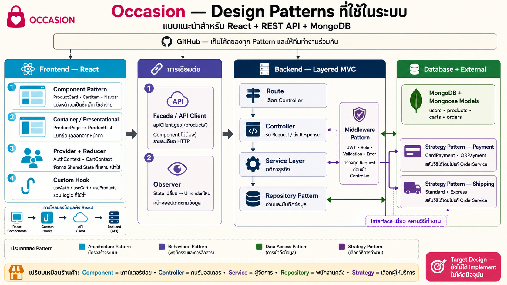

# Occasion — Design Patterns



> นี่คือ Target Design สำหรับการพัฒนา Occasion เป็น React + REST API + MongoDB หลัง Sprint 1 ยังไม่ใช่สิ่งที่ implement อยู่ใน repository ปัจจุบัน ดูสถานะจริงที่ [Sprint 1 Scope and Closeout](../SPRINT1_SCOPE.md)

## Pattern ที่เลือกใช้

| ส่วน | Pattern | ใช้กับ Occasion อย่างไร | ประโยชน์ |
|---|---|---|---|
| React UI | Component Pattern | แบ่งเป็น `ProductCard`, `CartItem`, `Navbar` | ใช้ซ้ำและทดสอบแยกส่วนได้ |
| React UI | Container / Presentational | `ProductPage` จัดการข้อมูล แล้วส่ง props ให้ `ProductList` แสดงผล | แยก logic ออกจากหน้าตา |
| React State | Provider + Reducer | `AuthContext`, `CartContext` และ reducer จัดการ shared state | ลดการส่ง props หลายชั้นและทำให้ state เปลี่ยนอย่างเป็นระบบ |
| React Logic | Custom Hook | `useAuth`, `useCart`, `useProducts` | รวม logic ที่ใช้ซ้ำโดยไม่ผูกกับหน้าตา |
| HTTP | Facade / API Client | `apiClient` ซ่อน base URL, token, JSON และ error handling | Component ไม่ต้องรู้รายละเอียด HTTP |
| React Update | Observer | เมื่อ state เปลี่ยน React render UI ใหม่ | หน้าจอสอดคล้องกับข้อมูลล่าสุด |
| Backend | Layered MVC | Route → Controller → Service → Repository | แต่ละชั้นมีหน้าที่ชัดและเปลี่ยนแยกกันได้ |
| Backend | Middleware | ตรวจ JWT, role, validation และ error | ใช้กติกากลางกับหลาย endpoint โดยไม่เขียนซ้ำ |
| Data Access | Repository | `ProductRepository`, `OrderRepository` คุยกับ Mongoose | Service ไม่ผูกกับคำสั่ง MongoDB โดยตรง |
| Payment/Shipping | Strategy | `CardPayment`, `QRPayment`, `StandardShipping`, `ExpressShipping` | เปลี่ยนวิธีชำระเงินหรือจัดส่งโดยไม่แก้ flow หลักของ order |

## ตัวอย่างโครงสร้างโฟลเดอร์เป้าหมาย

```text
frontend/src/
├── components/          # Component / Presentational
├── pages/               # Container
├── contexts/            # Provider + Reducer
├── hooks/               # Custom Hooks
└── services/apiClient.js # Facade

backend/src/
├── routes/              # Route
├── controllers/         # Controller
├── services/            # Service Layer + Strategy
├── repositories/        # Repository Pattern
├── models/              # Mongoose Models
└── middleware/          # Auth, Role, Validation, Error
```

## ตัวอย่าง Checkout ผ่านแต่ละ Pattern

1. `CheckoutPage` ซึ่งเป็น Container รับ event จากปุ่มยืนยันคำสั่งซื้อ
2. `useCart` อ่านข้อมูลจาก `CartContext`
3. `apiClient` ส่ง `POST /api/v1/checkout` พร้อม token
4. Auth และ validation middleware ตรวจ request
5. Checkout controller รับ request แล้วส่งงานต่อให้ `OrderService`
6. `OrderService` ใช้ `StockService` ตรวจสต็อกและเลือก Payment Strategy
7. `OrderRepository` บันทึกข้อมูลผ่าน Mongoose models ลง MongoDB
8. API ส่ง order กลับมา reducer อัปเดต `OrderState`
9. React render หน้ายืนยันคำสั่งซื้อใหม่ตาม state

## คำตอบสั้นสำหรับนำเสนอ

“Occasion ใช้ Component และ Container/Presentational Pattern เพื่อแบ่งหน้าจอ React, ใช้ Provider + Reducer จัดการ shared state, และใช้ Custom Hook รวม logic ที่ใช้ซ้ำ ฝั่ง Backend ใช้ Layered MVC แยก Route, Controller, Service และ Repository ส่วน Middleware ดูแล authentication/validation และ Strategy Pattern ช่วยสลับวิธีชำระเงินหรือขนส่งได้โดยไม่แก้ OrderService”

## ข้อควรระวัง

- Pattern เป็นแนวทางจัดระเบียบโค้ด ไม่ใช่ library ที่ติดตั้งแล้วทำงานเอง
- ไม่จำเป็นต้องใช้ทุก Pattern ตั้งแต่วันแรก ควรเพิ่มเมื่อปัญหาเกิดขึ้นจริง
- สำหรับโปรเจกต์นี้ยังไม่จำเป็นต้องใช้ Microservices, CQRS หรือ Event Sourcing เพราะเพิ่มความซับซ้อนเกินขนาดงาน
