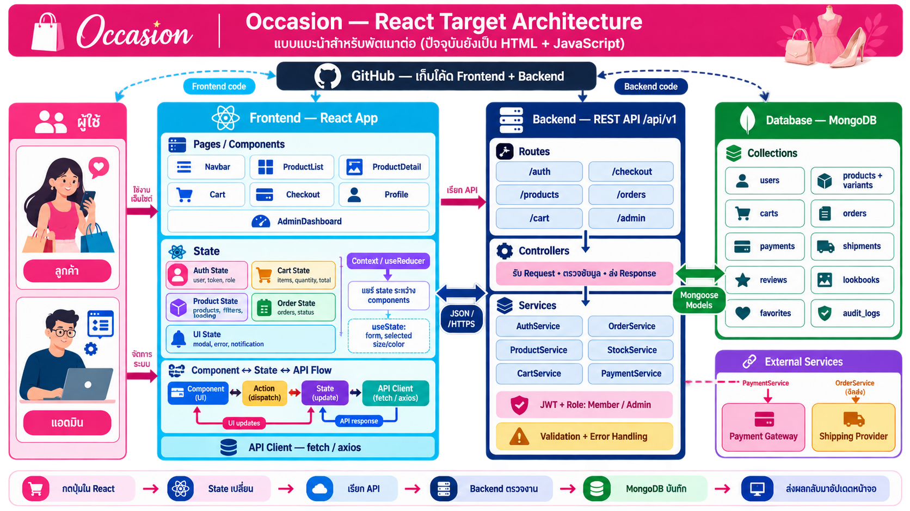

# Occasion — React Target Architecture

> ภาพนี้เป็นสถาปัตยกรรมเป้าหมายสำหรับพัฒนาหลัง Sprint 1 ปัจจุบัน repository ยังเป็น HTML, Tailwind CSS และ JavaScript และยังไม่มี React/Backend/MongoDB implementation จริง ดูสถานะจริงที่ [Sprint 1 Scope and Closeout](../SPRINT1_SCOPE.md)

## การเชื่อมโยงหลัก

| React Page / Component | State ที่ใช้ | API ที่เรียก | Backend Service | MongoDB Collection |
|---|---|---|---|---|
| `Navbar`, `Login`, `Profile` | `AuthState`: user, token, role | `/auth`, `/me` | `AuthService` | `users` |
| `ProductList`, `ProductDetail` | `ProductState`: products, filters, loading | `/products`, `/categories` | `ProductService` | `products`, `categories` |
| `ProductDetail`, `FavoriteButton` | favorites | `/favorites` | `FavoriteService` | `favorites` |
| `Cart` | `CartState`: items, quantity, total | `/cart` | `CartService`, `StockService` | `carts`, `products.variants` |
| `Checkout` | cart, address, payment selection | `/checkout` | `OrderService`, `StockService`, `PaymentService` | `orders`, `payments`, `shipments`, `carts` |
| `OrderHistory`, `OrderDetail` | `OrderState`: orders, status | `/orders` | `OrderService` | `orders`, `payments`, `shipments` |
| `Lookbook` | lookbooks, selected look | `/lookbooks` | `LookbookService` | `lookbooks` |
| `ReviewForm`, `ReviewList` | reviews, rating, form state | `/reviews` | `ReviewService` | `reviews` |
| `AdminDashboard` | dashboard summary, loading, filters | `/admin/dashboard` | Admin services | `orders`, `users`, `products`, `audit_logs` |
| `AdminProducts`, `AdminStock` | product form, variants, stock | `/admin/products`, `/admin/stock-adjustments` | `ProductService`, `StockService` | `products`, `stock_adjustments`, `audit_logs` |

## State ฝั่ง React

### Shared state

ข้อมูลที่หลายหน้าต้องใช้ร่วมกัน เหมาะกับ `Context + useReducer`:

- `AuthState`: ผู้ใช้ที่ล็อกอิน, token และ role
- `CartState`: สินค้าในตะกร้า, จำนวน และยอดรวม
- `ProductState`: รายการสินค้า, filter และสถานะ loading/error
- `OrderState`: รายการคำสั่งซื้อและสถานะล่าสุด
- `UIState`: notification หรือ error ที่ใช้ร่วมกันทั้งแอป

### Local state

ข้อมูลชั่วคราวที่ใช้เฉพาะ component เหมาะกับ `useState`:

- ค่าที่กรอกใน form
- สีและไซซ์ที่เลือก
- จำนวนสินค้าก่อนเพิ่มลงตะกร้า
- modal ที่เปิดอยู่
- page, sort และ filter เฉพาะหน้า

## Backend

Backend แบ่งความรับผิดชอบเป็นสามชั้น:

1. **Routes** รับ URL เช่น `/products` หรือ `/checkout`
2. **Controllers** ตรวจรูปแบบ request เรียก service และจัด response
3. **Services** ทำกติกาธุรกิจ เช่น ตรวจ stock, คำนวณยอด, สร้าง order และประสาน payment

ทุก member/admin request ต้องผ่าน JWT และตรวจ role ที่ Backend โดยไม่เชื่อ role จาก React โดยตรง

## ตัวอย่าง Checkout

1. `Checkout` อ่านสินค้าและยอดรวมจาก `CartState`
2. ผู้ใช้ยืนยันคำสั่งซื้อ แล้ว API Client ส่ง `POST /api/v1/checkout`
3. Controller ตรวจ request และข้อมูลสมาชิก
4. `StockService` ตรวจและหัก stock
5. `OrderService` สร้าง order และ snapshot ราคา/ที่อยู่
6. `PaymentService` สร้างรายการชำระเงิน
7. MongoDB บันทึก `orders`, `payments`, `shipments` และล้าง `carts`
8. Backend ส่ง order กลับมาให้ `OrderState`
9. React render หน้ายืนยันคำสั่งซื้อจาก state ใหม่

## GitHub อยู่ตรงไหน

GitHub เก็บ source code ของทั้ง React Frontend และ Backend เพื่อให้ทีมทำงานร่วมกันและติดตามการเปลี่ยนแปลง GitHub ไม่ใช่ API, Hosting หรือ Database และไม่ได้อยู่ในเส้นทางข้อมูลขณะลูกค้ากดซื้อสินค้า
